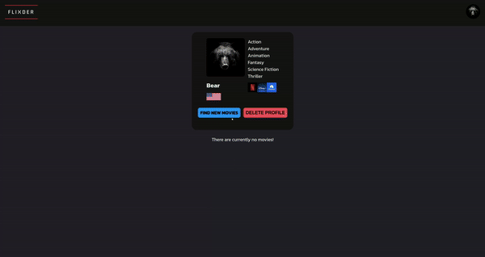
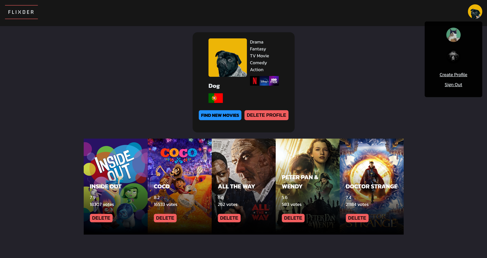
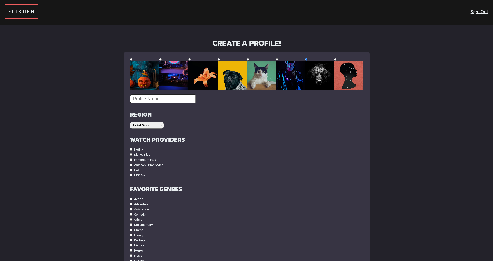

 

<h3 align="center">Flixder</h3>

Get matched with your next favorite movie!
 
 
<a href="https://flixder.netlify.app/">View Demo</a> . 
<a href="https://github.com/venoblin/flixder-backend">Back-End</a> 

Table of Contents

- [About The Project](#about-the-project)
  - [Built With](#built-with)

## About The Project

  

  

  

  

Flixder is an application that gathers random movies from your favorite genres and displays them in cards in front of you like a dating app. If you like a movie you swipe right and gets inserted in your movies to watch list. A fun way to find new movies to watch!

### Built With

This project was built with the following technologies:

- 
- 
- 
- 
- 
- 

