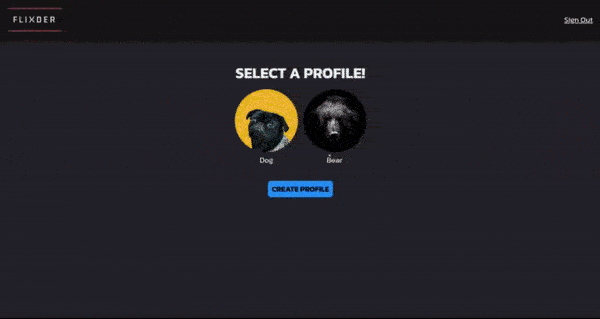
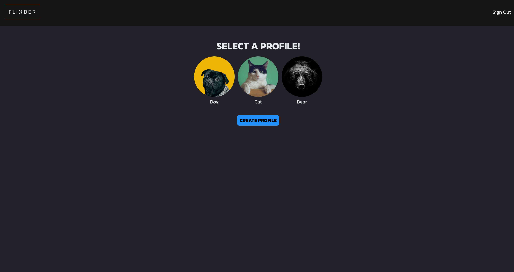
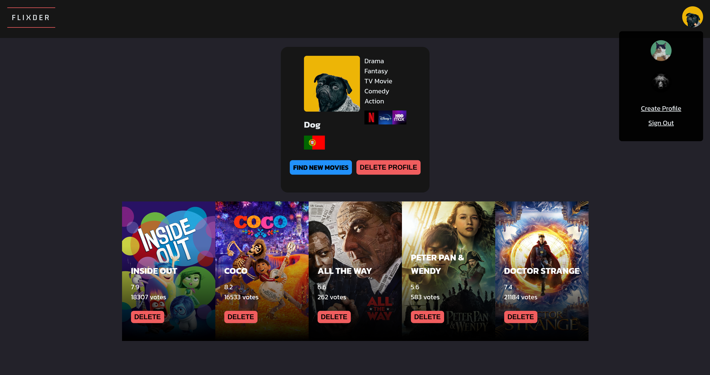

[LinkedIn](https://www.linkedin.com/in/jonathanvillagomezhernandez/) |
[Website](https://www.jonweb.dev/)

<!-- PROJECT LOGO -->
 

  <h1 align="center">Flixder</h3>

  

    Get matched with your next favorite movie!
     
    <a href="https://flixder.netlify.app/"><strong>View Demo</strong></a> | 
    <a href="https://github.com/venoblin/flixder-backend"><strong>Back-End</strong></a>
     
  

<!-- TABLE OF CONTENTS -->

  
Table of Contents

  <ol>
    <li>
      <a href="#about-the-project">About The Project</a>
      <ul>
        <li><a href="#built-with">Built With</a></li>
      </ul>
    </li>
  </ol>

<!-- ABOUT THE PROJECT -->
## About The Project

  

  

  

Flixder is an application that gathers random movies from your favorite genres and displays them in cards in front of you like a dating app. If you like a movie you swipe right and gets inserted in your movies to watch list. A fun way to find new movies to watch!

(<a href="#readme-top">back to top</a>)

### Built With
* React
* SASS
* Node.js
* Express
* MongoDB

(<a href="#readme-top">back to top</a>)

